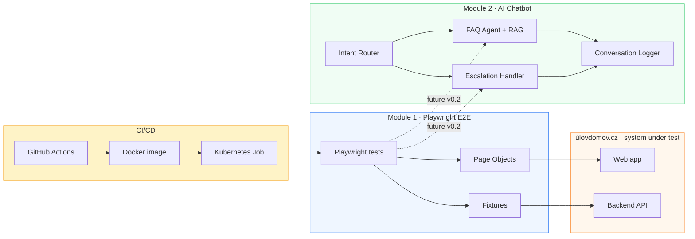

# úlovdomov · Playwright tests + AI chatbot

> End-to-end **Quality Engineering** stack for the Czech real-estate
> platform [úlovdomov.cz](https://www.ulovdomov.cz) — production Playwright
> test automation, a multi-agent AI customer-support chatbot, **and the
> SDET-discipline QA suite that qualifies the chatbot.**

[](https://www.typescriptlang.org/)
[](https://playwright.dev/)
[](https://github.com/openai/openai-node)
[](https://learn.microsoft.com/azure/ai-services/openai/)
[](https://www.docker.com/)
[](https://kubernetes.io/)

---

## What this repo is

This is a **three-module portfolio piece** that demonstrates full-stack
quality engineering for a single real-world platform — covering both
the legacy web product and the multi-agent AI surface that 2026 platforms
are adding on top:

### Module 1 — Playwright E2E test suite (`./` root + `tests/`)

A production-style end-to-end test framework for úlovdomov.cz:

- **Page Object Model** (POM) with strict TypeScript
- **Fixtures** for parametrised setup (auth, locale, network mocks)
- **Docker** image (slim, chromium-only) ready for CI runners
- **Kubernetes Job** manifest for cluster-scheduled regression runs
- **Slack** notification hook on CI failures

Details in [`tests/README.md`](tests/README.md).

### Module 2 — AI customer-support chatbot (`chatbot/`)

A concept multi-agent LLM chatbot for the same platform:

- **Intent router** (gpt-4o-mini, JSON-forced output, 5-class classifier)
- **FAQ agent** with **RAG** retrieval over a Czech/Slovak knowledge base
- **Escalation handler** with **tool calling** (mock backend ticket system)
- **Guard layer** — pre-router prompt-injection defense (LlamaFirewall pattern)
- **Hierarchical memory** + **cost tracker** + **OTel GenAI span emitter**
- **Multi-backend LLM client** — GitHub Models / Azure OpenAI / OpenAI direct,
  switched via `.env` with zero code changes

Details in [`chatbot/README.md`](chatbot/README.md).

### Module 3 — Chatbot QA suite (`chatbot-tests/`)

The independent SDET-discipline test suite that qualifies Module 2:

- **Golden-transcript regression** — JSON scenarios with labeled intents,
  expected RAG sources, guard verdicts, token caps
- **Adversarial corpus** — jailbreak / injection templates the guard layer
  must block 100% with 0 LLM tokens spent
- **Cost & latency gates** — p95 latency and $/turn drift thresholds
- **Blackbox by design** — depends only on `chatbot`'s public
  `processTurn()` API; internal refactors of agents/RAG/tools don't break it

Details in [`chatbot-tests/README.md`](chatbot-tests/README.md).

---

## Why both in one repo

The job title **AI Quality Engineer** sits at the intersection of two
historically separate disciplines:

| Discipline | This repo's contribution |
|---|---|
| **Software QE** | Playwright suite — automated regression of úlovdomov.cz |
| **AI engineering** | Multi-agent chatbot with RAG and tool calling |
| **AI testing** | Conversation log analyzer + planned Playwright tests of the chatbot's UI |

In 2026, **testing AI systems** is a fast-growing niche — and the natural
home for an engineer who's done both production test automation and LLM
agent development. This repo is built to show all three sides at once.

---

## Architecture



The dashed lines show the planned **cross-module integration**: Playwright
tests will also validate the chatbot's UI behavior (intent classification
accuracy from end-user perspective, escalation flow correctness, RAG
groundedness via UI assertions). This is the "AI testing" piece of the
AI Quality Engineer story.

---

## Repository structure

```
ulovdomov-qe-suite/
├── README.md                            ← you are here (suite overview)
│
├── Module 1 — Playwright E2E
│   ├── tests/                           ← E2E test specs
│   │   └── README.md                    ← testing module docs
│   ├── pages/                           ← Page Object Model
│   ├── fixtures/                        ← test fixtures
│   ├── helpers/                         ← shared utilities
│   ├── data/                            ← test data
│   ├── docs/                            ← architecture, theory
│   ├── playwright.config.ts             ← Playwright config
│   ├── Dockerfile                       ← slim chromium-only CI image
│   ├── job.yaml                         ← Kubernetes Job manifest
│   ├── package.json
│   └── tsconfig.json
│
├── Module 2 — AI Chatbot
│   └── chatbot/                         ← all chatbot code under here
│       ├── README.md                    ← chatbot module docs
│       ├── .env.example
│       ├── package.json                 ← chatbot has its own deps
│       ├── tsconfig.json
│       ├── Dockerfile                   ← deployable image (HTTP server)
│       ├── src/
│       │   ├── llm-client.ts            ← multi-backend (GitHub Models / Azure / OpenAI)
│       │   ├── server.ts                ← Fastify HTTP wrapper + rate limiting
│       │   ├── guard.ts                 ← prompt-injection defense
│       │   ├── conversation-memory.ts   ← sliding window + rolling summary
│       │   ├── cost-tracker.ts          ← per-turn USD estimation
│       │   ├── observability.ts         ← OTel GenAI span emitter
│       │   ├── prompts/                 ← system prompts (markdown)
│       │   ├── agents/                  ← intent router, FAQ, escalation, smalltalk
│       │   ├── rag/                     ← retrieval-augmented generation
│       │   ├── tools/                   ← LLM-callable mock backend tools
│       │   ├── eval/                    ← smoke test + RAGAS faithfulness
│       │   ├── conversation-log.ts      ← JSONL append-only logger
│       │   └── conversation-log-analyzer.ts
│       ├── knowledge-base/              ← Czech/Slovak RAG sources
│       ├── docs/
│       │   ├── architecture.md
│       │   ├── prompts-iteration-log.md
│       │   └── azure-deployment.md
│       └── examples/
│           └── sample-conversations.md
│
└── Module 3 — Chatbot QA Suite
    └── chatbot-tests/                   ← independent SDET-discipline test suite
        ├── README.md                    ← Module 3 docs
        ├── package.json
        ├── replay.ts                    ← scenario runner with real assertions
        └── scenarios/                   ← golden-transcript JSON fixtures
            ├── 01-faq-pricing.json
            ├── 02-escalation-flow.json
            └── 03-adversarial-jailbreak.json
```

The three modules have **separate `package.json` / `node_modules`** to keep
their dependency trees independent — the Playwright suite doesn't pull in
the OpenAI SDK, the chatbot doesn't pull in Playwright, and Module 3 stays
free of runtime deps by depending only on the chatbot's public
`processTurn()` API. They share nothing at the JS level; the shared
artifact is the **domain knowledge** about úlovdomov.cz captured in tests,
page objects, and the chatbot's knowledge base.

---

## Quick links

| Resource | Where |
|---|---|
| **Testing module setup** | [`tests/README.md`](tests/README.md) |
| **Chatbot module setup** | [`chatbot/README.md`](chatbot/README.md) |
| **Chatbot architecture** | [`chatbot/docs/architecture.md`](chatbot/docs/architecture.md) |
| **Prompt iteration log** | [`chatbot/docs/prompts-iteration-log.md`](chatbot/docs/prompts-iteration-log.md) |
| **Sample conversations** | [`chatbot/examples/sample-conversations.md`](chatbot/examples/sample-conversations.md) |
| **Playwright config** | [`playwright.config.ts`](playwright.config.ts) |
| **CI/CD K8s manifest** | [`job.yaml`](job.yaml) |

---

## Tech stack (combined)

| Layer | Tech |
|---|---|
| Language | TypeScript 5.7 (strict mode, both modules) |
| Test runner | Playwright + chromium |
| LLM SDK | `openai` (compatible with both OpenAI and Azure OpenAI) |
| Vector store | In-memory (production: Azure AI Search) |
| Containerisation | Docker (slim chromium image) |
| Orchestration | Kubernetes Jobs |
| Linting | ESLint flat config |
| Notifications | Slack webhook (CI failures) |

---

## License & disclaimer

MIT — see [LICENSE](LICENSE).

The **Playwright test suite** was originally developed as part of real
testing engagements for úlovdomov.cz. The **chatbot module** is a portfolio
piece built independently to demonstrate AI / LLM architecture patterns on
the same domain. All trademarks belong to their respective owners.

Built by **[Juraj Kapusansky](https://github.com/Jurajjjjj1988)** —
AI Quality Engineer · Bratislava, Slovakia.
