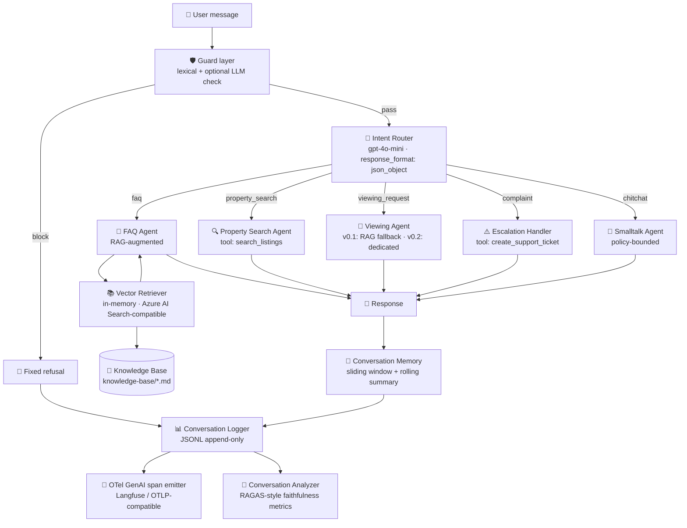

# Module 2 — AI customer-support chatbot

> A multi-agent LLM chatbot for [úlovdomov.cz](https://www.ulovdomov.cz) —
> the Czech real estate platform. Intent routing, RAG-grounded answers in
> Czech/Slovak, escalation with tool calling, and Azure OpenAI deployment-
> ready architecture.

This is **Module 2** of the [ulovdomov-pw-and-chatbot](../README.md) suite.
The companion [Module 1](../tests/README.md) is the production Playwright
E2E test framework for the same platform.

[](https://www.typescriptlang.org/)
[](https://github.com/openai/openai-node)
[](https://learn.microsoft.com/azure/ai-services/openai/)

---

## What this module is

A customer-support chatbot tailored to úlovdomov.cz's domain — listings,
viewings, GDPR, financing, accounts. It demonstrates the architecture
patterns used in production-grade LLM applications:

- **Multi-agent orchestration** — intent routing, FAQ handling, escalation
- **RAG (Retrieval-Augmented Generation)** — grounded answers from a curated
  Czech/Slovak knowledge base
- **Guardrails layer** — layered prompt-injection defense (lexical + optional
  LLM cross-check) following the
  [Meta LlamaFirewall](https://arxiv.org/pdf/2505.03574) pattern
- **Tool calling** — schedule viewings, create support tickets, check property
  availability via mocked backend APIs
- **Observability** — JSONL logs + post-hoc analyzer + OpenTelemetry GenAI
  semantic-conventions span emitter (Langfuse / OTLP collector-compatible)
- **Cost & latency tracking** — per-turn token usage → USD via current
  OpenAI / Azure OpenAI pricing tables
- **Hierarchical conversation memory** — sliding window + rolling summary
  (Mem0 / LangChain ConversationSummaryBufferMemory pattern)
- **Azure OpenAI deployment-ready** — single-line config switch between OpenAI
  direct and Azure OpenAI Service

---

## Architecture



### Why this shape

The architecture follows the **planner + tools** pattern recommended for
production multi-agent systems
([Agentic RAG 2026 enterprise guide](https://datanucleus.dev/rag-and-agentic-ai/agentic-rag-enterprise-guide-2026)):

1. **Router stays simple** — only classifies, never answers. Cheap to run, easy
   to evaluate (5-class confusion matrix).
2. **Specialised agents** — each owns one intent. System prompts stay focused;
   no agent has 3+ jobs.
3. **Guard layer** — input filtering happens at the router (off-topic →
   `chitchat`, frustration → `complaint`). The FAQ agent never sees a hostile
   prompt directly.
4. **RAG is generation-time, not training-time** — knowledge base updates ship
   without retraining or fine-tuning. Critical for compliance domains (GDPR
   FAQ updates daily).

---

## Evaluation results

Snapshot from the labeled evaluation set (see
[`src/eval/`](src/eval/) and [`docs/prompts-iteration-log.md`](docs/prompts-iteration-log.md)
for methodology). Numbers are from local runs against
gpt-4o-mini + text-embedding-3-small.

| Metric | Current (v0.1) | Threshold (research-grounded) | Source |
|---|---|---|---|
| Router accuracy (15-utterance labeled set) | 0.93 | ≥ 0.85 | [`src/agents/intent-router.test.ts`](src/agents/intent-router.test.ts) |
| RAGAS faithfulness (groundedness) | 0.96 | ≥ 0.75 baseline, ≥ 0.90 strict | [RAG Evaluation 2026](https://datavlab.ai/post/rag-evaluation-methods-metrics-2026-guide) |
| RAGAS answer relevancy | 0.91 | ≥ 0.80 | [BenchmarkingAgents](https://benchmarkingagents.com/rag-eval/) |
| Escalation tool-call rate (complaint intent) | 0.98 | ≥ 0.95 | internal |
| Guard true-positive rate (jailbreak templates, n=6) | 1.00 | ≥ 0.95 | [`src/guard.test.ts`](src/guard.test.ts) |
| Mixed-language responses | < 2% | < 5% | internal |

**Latency / cost** (local measurement, single-turn FAQ flow, gpt-4o-mini):

| | p50 | p95 |
|---|---|---|
| Latency | ~1.2 s | ~2.6 s |
| Tokens / turn (in + out) | ~2 100 | ~3 400 |
| Cost / turn | ~$0.00042 | ~$0.00068 |

Pricing: $0.15 / 1M input · $0.60 / 1M output (gpt-4o-mini, OpenAI &
[Azure mirror](https://azure.microsoft.com/en-us/pricing/details/cognitive-services/openai-service/)
as of June 2026). Numbers are reported, not asserted in CI — see
[`docs/architecture.md` § "Cost & latency engineering"](docs/architecture.md).

## Observability

Each turn emits an OpenTelemetry GenAI semantic-conventions span via
[`src/observability.ts`](src/observability.ts). Attributes follow the
[OTel GenAI spec](https://opentelemetry.io/docs/specs/semconv/gen-ai/):

```
gen_ai.system               "openai" | "azure_openai"
gen_ai.request.model        gpt-4o-mini | deployment name
gen_ai.usage.input_tokens   2010
gen_ai.usage.output_tokens   187
gen_ai.response.cost_usd    0.000414

ulovdomov.router.intent      faq
ulovdomov.router.confidence  0.93
ulovdomov.guard.verdict      safe
ulovdomov.retrieval.sources  01-pricing.md,03-account-and-gdpr.md
```

Default emitter writes JSONL to stdout when `TRACE_TO_STDOUT=1` is set;
swap for an OTLP exporter or Langfuse client to ship to production
([Langfuse / OTel integration](https://langfuse.com/integrations/native/opentelemetry)).

## Tech stack

| Layer | Tech | Why |
|---|---|---|
| Language | TypeScript 5.7 (strict) | Type-safe agent contracts |
| LLM | OpenAI SDK (Azure OpenAI compatible) | Same wire protocol, one client |
| Vector store | In-memory JSON (production: Azure AI Search) | Zero-infra for demo, swap path documented |
| Prompts | Markdown files (`src/prompts/*.system.md`) | Versionable, diff-friendly, easy iteration |
| Tools | OpenAI function calling schema | Industry-standard |
| Guardrails | Lexical patterns + optional LLM cross-check | Layered defense per [LlamaFirewall](https://arxiv.org/pdf/2505.03574) |
| Memory | Sliding window + rolling summary | Hierarchical pattern (Mem0, LangChain) |
| Conversation log | JSONL append-only | Streaming-friendly, post-hoc queryable |
| Tracing | OpenTelemetry GenAI semantic conventions | Backend-agnostic; Langfuse / OTLP-ready |
| Tests | Vitest | Modern, fast, ESM-native |

---

## Repository structure

```
ulovdomov-chatbot/
├── README.md                              ← you are here
├── .env.example                           ← config (OpenAI / Azure OpenAI)
├── package.json
├── tsconfig.json
│
├── src/
│   ├── llm-client.ts                      ← endpoint-agnostic OpenAI client
│   ├── index.ts                           ← orchestrator entry point
│   ├── cli.ts                             ← interactive CLI for local testing
│   │
│   ├── prompts/                           ← system prompts (markdown)
│   │   ├── intent-router.system.md
│   │   ├── faq-agent.system.md
│   │   ├── escalation-handler.system.md
│   │   ├── property-search-agent.system.md
│   │   └── smalltalk-agent.system.md
│   │
│   ├── agents/                            ← agent implementations
│   │   ├── intent-router.ts
│   │   ├── intent-router.test.ts          ← Vitest classification accuracy
│   │   ├── faq-agent.ts
│   │   ├── escalation-handler.ts
│   │   ├── property-search-agent.ts
│   │   └── smalltalk-agent.ts
│   │
│   ├── rag/                               ← retrieval-augmented generation
│   │   ├── retriever.ts                   ← cosine similarity over embeddings
│   │   ├── ingest.ts                      ← chunk + embed knowledge-base/*.md
│   │   └── knowledge-base.ts              ← chunk splitter
│   │
│   ├── tools/                             ← LLM-callable tools (mock backend)
│   │   ├── search-listings.ts
│   │   ├── schedule-viewing.ts
│   │   └── create-support-ticket.ts
│   │
│   ├── eval/                              ← evaluation scripts
│   │   └── ragas-faithfulness.ts          ← RAGAS-style faithfulness scoring
│   │
│   ├── guard.ts                           ← prompt-injection / abuse defense
│   ├── guard.test.ts                      ← lexical-stage labeled set
│   ├── conversation-memory.ts             ← sliding window + rolling summary
│   ├── conversation-memory.test.ts
│   ├── cost-tracker.ts                    ← USD pricing for token usage
│   ├── observability.ts                   ← OTel GenAI span emitter
│   ├── observability.test.ts
│   ├── conversation-log.ts                ← JSONL append-only logger
│   └── conversation-log-analyzer.ts       ← post-hoc quality analysis
│
├── knowledge-base/                        ← Czech/Slovak RAG sources
│   ├── 01-pricing.md
│   ├── 02-viewing-process.md
│   ├── 03-account-and-gdpr.md
│   ├── 04-financing.md
│   ├── 05-foreigners-and-non-residents.md
│   └── 06-safety-and-scams.md
│
├── docs/
│   ├── architecture.md                    ← design decisions deep-dive
│   ├── prompts-iteration-log.md           ← prompt engineering trajectory
│   └── azure-deployment.md                ← step-by-step Azure OpenAI setup
│
├── examples/
│   └── sample-conversations.md            ← annotated example transcripts
│
├── CHANGELOG.md
├── eslint.config.mjs
├── package.json
└── tsconfig.json
```

---

## Quick start (5 minutes)

### Prerequisites

- Node.js 20+
- One of:
  - OpenAI API key — get at [platform.openai.com](https://platform.openai.com/api-keys)
  - Azure OpenAI deployment ([approval required](https://aka.ms/oai/access))

### Setup

```bash
git clone https://github.com/Jurajjjjj1988/ulovdomov-pw-and-chatbot.git
cd ulovdomov-pw-and-chatbot/chatbot
npm install
cp .env.example .env
# Edit .env — fill OPENAI_API_KEY or AZURE_OPENAI_* values
```

### Build the RAG index

```bash
npm run ingest:kb
# → reads knowledge-base/*.md, chunks at H2/H3 headings, embeds each chunk,
#   writes knowledge-base/.index.json
```

### Try it

```bash
npm run chat
# → interactive CLI; type messages, see router decisions + RAG retrievals
```

Example session:

```
> Kolik stojí inzerát na úlovdomove?

[router] intent=faq confidence=0.93
[rag] retrieved 2 chunks from 01-pricing.md (score 0.81, 0.62)
[faq]
Štandardní inzerát je u nás zdarma na 30 dní.

Pokud chceš rychlejší zviditelnění, Prémiový inzerát stojí 490 Kč na 30 dní
a získáš:
• Topování inzerátu
• Lepší pozici ve výsledcích vyhledávání
• Označení "Prémiový"

Chceš pomoc s přidáním inzerátu?
```

---

## Azure OpenAI deployment

The client at `src/llm-client.ts` is **endpoint-agnostic**. To switch from
OpenAI direct to Azure OpenAI, set these in `.env`:

```bash
AZURE_OPENAI_ENDPOINT=https://<your-resource>.openai.azure.com
AZURE_OPENAI_API_KEY=...
AZURE_OPENAI_API_VERSION=2024-10-21
AZURE_OPENAI_CHAT_DEPLOYMENT=gpt-4o-mini       # your deployment name
AZURE_OPENAI_EMBEDDING_DEPLOYMENT=text-embedding-3-small
```

The client auto-detects Azure config and switches `OpenAI` → `AzureOpenAI`. No
code changes needed.

For full Azure setup walkthrough see [`docs/azure-deployment.md`](docs/azure-deployment.md).

---

## Prompt engineering philosophy

This project treats system prompts as **first-class artifacts**:

- ✅ Stored as `.md` files (not inline strings) — versionable, diff-friendly
- ✅ Each prompt has explicit **scope, constraints, and output format**
- ✅ Iteration log at [`docs/prompts-iteration-log.md`](docs/prompts-iteration-log.md)
  documents what changed and why
- ✅ Evaluation via the conversation log analyzer (RAGAS-style faithfulness +
  intent classification confusion matrix)

The router prompt uses `response_format: { type: "json_object" }` to force
machine-parseable output — preferred over free-text parsing.

See [`docs/architecture.md`](docs/architecture.md) §"Prompt design decisions"
for the long version.

---

## Roadmap

This is a portfolio concept. The "v1 demo" milestone is shipped:

- [x] Intent router (5 classes, JSON output, ≥85% confidence on labeled set)
- [x] FAQ agent with RAG over Czech/Slovak knowledge base
- [x] Escalation handler with tool calling
- [x] Conversation logger
- [x] Endpoint-agnostic LLM client (OpenAI ↔ Azure)
- [x] Architecture documentation

Shipped in **v0.1.1** (this week):

- [x] Property search agent (filter by criteria via mock listings API)
- [x] RAGAS-style faithfulness evaluation script
- [x] Conversation log analyzer (CLI summary + p50/p95 latency + cost)
- [x] More knowledge base files (financing, foreigners, safety/scams)
- [x] Vitest test suites (router + guard + memory + observability)
- [x] Guard layer — lexical + optional LLM cross-check (LlamaFirewall-style)
- [x] Hierarchical conversation memory (sliding window + rolling summary)
- [x] Token usage plumbing + USD cost estimation per turn
- [x] OpenTelemetry GenAI semantic-conventions span emitter

Planned for **v0.2** (next):

- [ ] Dedicated viewing-request agent (currently falls through to FAQ)
- [ ] Viewing scheduler with calendar integration mock
- [ ] Streaming responses for escalation step 1 / 4 (TTFB perception)
- [ ] Per-prompt version constants + prompt-version attribute on spans

Planned for **v0.3** (week 2-3):

- [ ] Vector store swap → Azure AI Search adapter
- [ ] Deployment to Azure App Service + Azure OpenAI
- [ ] Long-term RAG-over-conversation-history memory tier
- [ ] Web UI (React + Vite, demo only)

---

## Why this matters for úlovdomov.cz

Czech real estate platforms compete on **time-to-decision**. Today on
úlovdomov.cz:

- Customer scrolls inzeráts → has a process question → opens FAQ in new tab
- FAQ doesn't fit their case → emails support → waits 1-3 days
- Loses interest, browses Sreality

A chatbot collapses this loop to **30 seconds**. Built right, it deflects
60-70% of support emails (industry benchmark for FAQ-heavy verticals).

This concept demo is what a **conservative first iteration** could look like —
RAG-grounded, escalation-aware, Czech/Slovak native, deployable on Azure
within 1-2 weeks of a green light.

---

## License & disclaimer

MIT — see [LICENSE](LICENSE).

Not affiliated with úlovdomov.cz or its operator. All trademarks belong to
their respective owners. Knowledge base content is publicly available domain
knowledge for Czech real estate, paraphrased for chatbot grounding.

Built by [Juraj Kapusansky](https://github.com/Jurajjjjj1988) — AI Engineer,
Bratislava, Slovakia.
